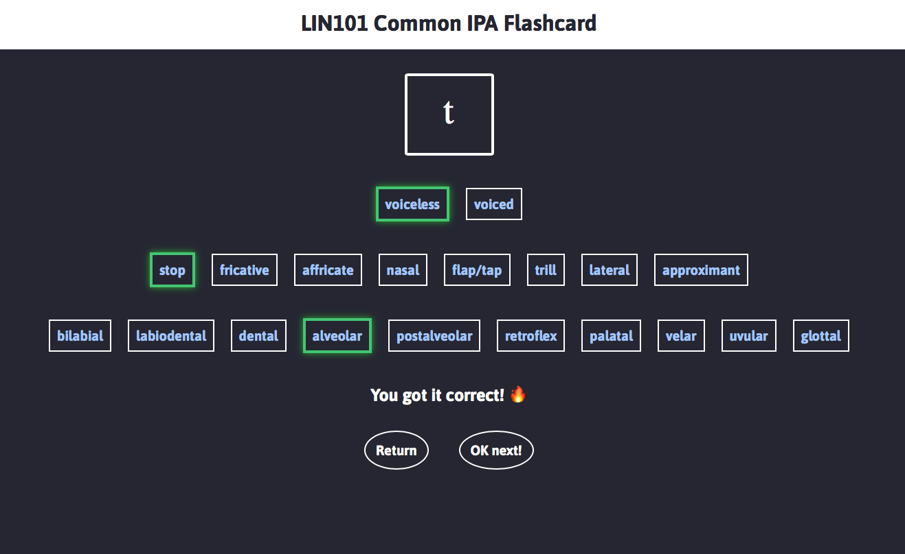

# LIN101-IPA

[IPA Flashcards](https://rwang97.github.io/LIN101-IPA/) designed specifically for LIN101 at UofT. 

Note: to make things simple, labio-velar approximant [w] is not included in the flashcards.

